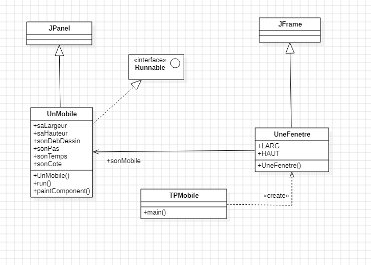
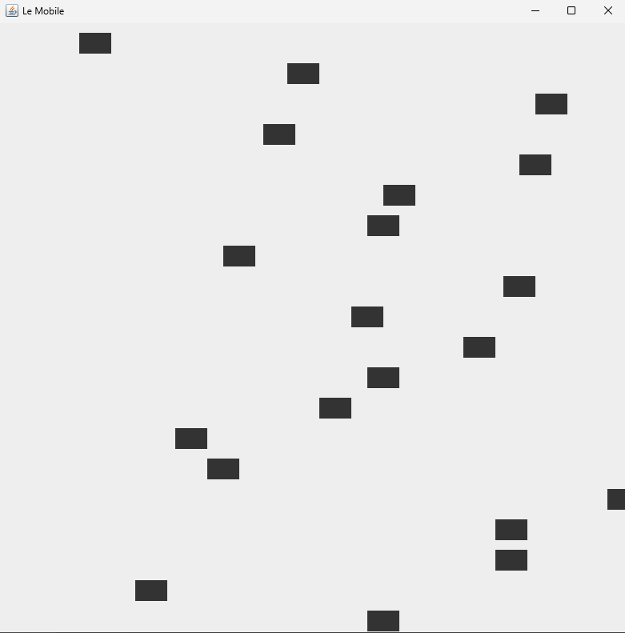
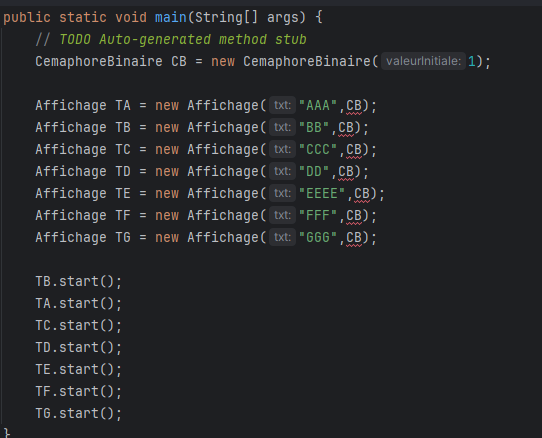
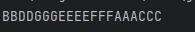
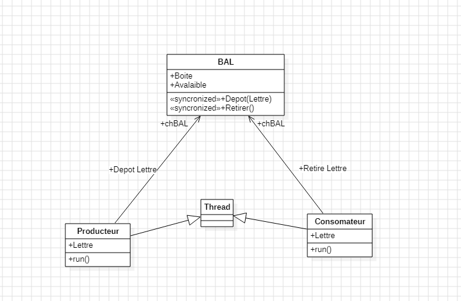
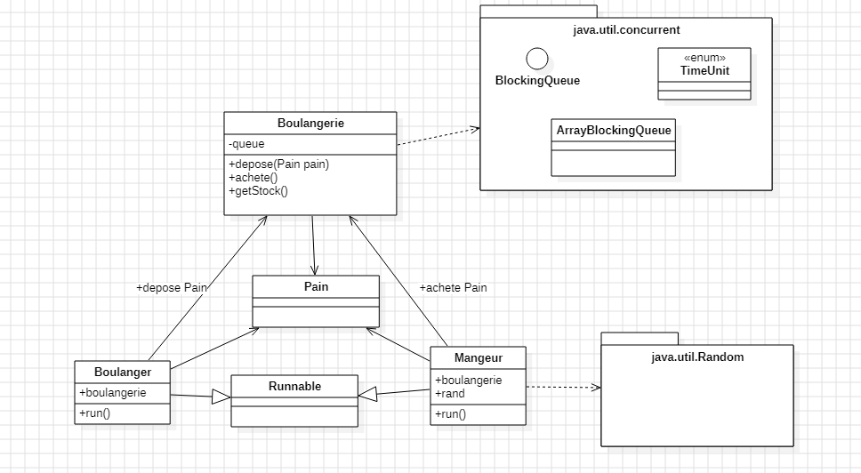
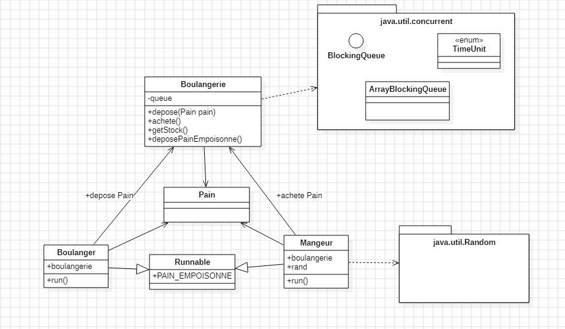

# Rapport Programmation Advancé

## 1/Introduction

L’objectif de cette matière est d’approfondir notre connaissance sur 
l’environnement de développement pour cela, nous devions réaliser différents TP 
concernant les Threads , la synchronisation et la programmation concurrence.

Mais Avant de démarré ces Tp, nous devions Rechercher les différents 
caractéristique de l’ordinateur de travail, pour connaître les différents 
performances qu’avait chaque Pc. 

|                       | G25                                             | I21                                             | G24                                                      |
|-----------------------|-------------------------------------------------|-------------------------------------------------|----------------------------------------------------------|
| CPU                   | i7 4770,4c/8t, 304GHz, 3.9GHz Turbo, 64-bit | i7 4770,4c/8t, 304GHz, 3.9GHz Turbo, 64-bit | i7 4770,4c/8t, 304GHz, 1.4GHz - 4.7GHz Turbo, 64-bit |
| RAM                   | 8Go RAM Micron MT16KTF1G64AZ-1 1G8E1 DD         |                                                 |                                                          |
| GPU                   |                                                 |                                                 |                                                          |
| Disque (C:)           |                                                 |                                                 |                                                          |
| Type de disque        | SSD                                             | SSD                                             | SSD                                                      |
| Fichier de pagination | Oui                                             | Oui                                             | Oui                                                      |
| Fichier d'échange     | Oui                                             | Oui                                             | Oui                                                      |

## 2/TP1

### 2.1/Objectif

L’objectif de ce TP est d’afficher une Fenêtre où on peut retrouver un Mobile (sous la forme d’un carré) se déplacent de la gauche de la fenêtre jusqu'à la droite de la fenêtre.

Il fallait aussi permettre aux Mobile de faire un aller- retour (après avoir atteint la droite de la fenêtre il repartait vers la gauche).

Il fallait aussi ajouter un Bouton permettant d’arrêté le Mobile ou de lui permettre de continuer lors qu’on appuyait dessus.

### 2.2/Classe

Comme on peut le voir dans ce graphique on utilise :
- 3 Classe
- 1 Inteface
- 2 Module

La classe **TPMobile()** n'a que une fonction main servant à lancé les autres classes

La classe **UneFenetre()** permet d'afficher une interface auquel seront afficher entre 1 et N Mobile

On y retrouve 2 attribut :
- LARG : il est de type Int et il signifie la Largueur de l'interface crée
- HAUT : il est de type Int et il signifie la Hauteur de l'interfece crée

On y retrouve 1 fonction :
- UneFenetre() : elle permet de crée un Interface et Initialiser les différents Mobiles

La classe **UnMobile()** permet d'initialiser un Mobile

On y retrouve 6 attribut :
- saLargeur : il est de type Int et il signifie la Largueur de l'interface (limite imposer)
- saHauteur : il est de type Int et il signifie la Hauteur de l'interface (limite imposer)
- sonDebDessin : il est de type Int et il signifie la Position du Mobile
- sonPas : il est de type Int et il signifie la distance de deplacement
- sonTemps : il est de type Int et il indique le temps d'attente entre ces déplacements (sa vitesse)
- sonCote : il est de type Int et il indique la taille du Mobile

On y retrouve 3 fonction :
- UnMobile() : fonction constructeur permettant d'initialiser les différents attibut de la classe
  - Il a besoin de 2 valeur telleLargeur et telleHauteur, ils sont tout les de type Int, l'un permet d'initialiser saLargeur et saHauteur
- run() : fonction servant à faire déplacer le Mobile sur l'interface
- paintComponent() : fontion permet de changer de couleur le Mobile

### 2.3/Information

**Tread** : permet d'effectuer plusieurs action / programme en même temps. 
**Ressource critique** : Ressource utiliser que par 1 processus à la fois. Ex: Zone Mémoire, imprimante  
**Section critique** : Portion de code n'executant que 1 thread. (Mais plusisuer thread cherche à y asséder) 
**Verrou MUTEX** : verrou permettant de bloquer un thread durant une Exclusion Mutuelle 

### 2.4/Representation
Voici une representation de la version Final du TP

## 3/TP2

### 3.1/Objectif

L’objectif de ce TP est d’apprendre et tester ce qu’est la section critique.

Pour le réaliser nous devions demander à différente taches de d’afficher leur donné en même temps.

Par exemple Une première tache devait afficher AAA et une deuxième devait afficher BB, Il devait afficher de manière à avoir AAABB ou BBAAA  mais pas ABABA ni BAAAB et encore moins AABBA.

Nous devions après réaliser ce travail en utilisant des Sémaphores (pour notre cas nous n’utilisions qu’une version Binaire du Sémaphore)

### 3.2/Classe

Dans ce TP on retrouve :
- 4 classes

La classe **Main()** n'a que une fonction main servant à lancé les autres classes

La classe **Affichage()** permet d'afficher un texte

On y retrouve 2 attribut :
- texte : il est de type String et il indique la texte qui seras afficher
- cemaphore : il est de type CemaphoreBinaire et il indique un CemaphoreBinaire

On y retrouve 2 fonction :
- Affichage() : fonction constructeur permettant d'initialiser les différents attibut de la classe
- run() : fonction servant à afficher l'attibut texte

La classe **CemaphoreBinaire()** utiliser comme Cemaphore mais seul 1 valeur peut avancer
  Il est une extention de Cemaphore
On y retrouve 2 fonction :
- CemaphoreBinaire() : fonction constructeur permettant d'initialiser les différents attibut de la classe
  - Il a besoin de 1 valeur valeurInitiale, il est de type int et il permet d'envoyer un numero indicant à Cempahore le nombre de personne pouvant sirculer 
- syncSignal() : fonction servant à envoyer un signal signifiant que l'acces est disponible

### 3.3/Information

à la maniére d'un sémaphore on bloque l'accée pour que 1 thread passe à la fois 
**Wait()** = stop l'accée à la ressource 
**Signal()** = donne l'information que la ressource est libérrer 

### 3.4/Representation

Comme on peut voir dans cet extrait de code 7 Tread sont lancé en même temps avec différentes valeur à afficher

Comme on peut le voir en Sortie Même si les 7 Traed sont lancé en même temps mais il affiche leur valeur les uns aprés les autres
(Dans cet exemple leur à été {B,D,G,E,F,A,C} )

## 4/TP3

### 4.1/Objectif

L’objectif de ce TP était de simuler une boite aux lettre où des Producteur écrivait une lettre puis la déposait et un consommateur devait récupérer la lettre et la lire.

### 4.2/Classe

Dans ce TP on retrouve :
- 4 classes

La classe **Main()** n'a que une fonction main servant à lancé les autres classes

La classe **Bal()** permet de stocker les Lettres et de savoir si une lettre est disponnible

On y retrouve 2 attribut :
- Boite : il est de type String et il contient le lettre (text enregistré)
- Avalaible : il est de type Boolean et il indique si une lettre est disponible ou non

On y retrouve 3 fonction :
- Bal() : fonction constructeur permettant d'initialiser les différents attibut de la classe
- Depot() : fonction Servant à enregistrée une nouvelle lettre
- Retirer() : fonction servant à obtenir le contenue de Boite quand Avalaible est False

La classe **Consomateur()** utiliser pour representer un Consomateur il a comme role de Retirer une lettre et de la lire

On y retrouve 2 attribut :
- Lettre : il est de type String et il contient le lettre (text enregistré)
- bal : il est de type Bal et il contient la Boite aux Lettre (Une classe Bal centrale)

On y retrouve 2 fonction :
- Consomateur() : fonction constructeur permettant d'initialiser les différents attibut de la classe
- run() : fonction servant à demander une lettre à la boite aux lettre (Element bal)
  
La classe **Producteur()** utiliser pour representer un Producteur il a comme role de Déposer une lettre dans la Boite aux Lettre (BAL)

On y retrouve 2 attribut :
- Lettre : il est de type String et il contient le lettre (text enregistré)
- bal : il est de type Bal et il contient la Boite aux Lettre (Une classe Bal centrale)

On y retrouve 2 fonction :
- Producteur() : fonction constructeur permettant d'initialiser les différents attibut de la classe
- run() : fonction servant à deposer une lettre dans boite aux lettre (Element bal)

### 4.3/Information

Les differents modules cherche à avancer mais il sont bloquer par le Cemaphore ,
Il est possible que un module ne puisse pas avancer durant un long momment car le cemaphore ne lui lesse pas l'acces

### Les Moniteurs
Objet de syncronisation permettant l'exclusion mutuelle entre opérateur sur des données et d'attendre qu'une condition soit validé puis donner l'accées

Dans un moniteur on retrouve :
- Un attribut qui à la ressources partagé
- Un attribut qui à la variable de syncronisation
- Une méthode write
- Une méthode read

## 5/TP3 Version BlockingQueue

### 5.1/Objectif

L’objectif de ce TP est de refaire le TP3 mais dans une Version BlockingQueue

### 5.2/Classe

Dans ce TP on retrouve :
- 4 classes

La classe **Main()** n'a que une fonction main servant à lancé les autres classes

La classe **Boulangerie()** permet de stocker les Pain et de savoir si une PAIN est disponnible

On y retrouve 1 attribut :
- queue : il est de type String et il contient le lettre (text enregistré)

On y retrouve 3 fonction :
- depose() : fonction Servant à enregistrée un nouveau PAIN
- achete() : fonction servant à obtenir un Pain de la réserve (element queue)
- getStock() : fonction permettant de savoir le nombre de pain disponible

La classe **Mangeur()** utiliser pour representer un Consomateur il a comme role de Retirer un pain

On y retrouve 2 attribut :
- boulangerie : il est de type Boulangerie et il contient la Boulangerie (Une classe Boulangerie centrale)
- rand : il est de type Random et il contient le temps entre chaque demande

On y retrouve 2 fonction :
- Mangeur() : fonction constructeur permettant d'initialiser les différents attibut de la classe
- run() : fonction servant à demander un PAIN à la Boulangerie (Element boulangerie)

La classe **Boulanger()** utiliser pour representer un Producteur il a comme role de Déposer une lettre dans la Boite aux Lettre (BAL)

On y retrouve 1 attribut :
- boulangerie : il est de type Boulangerie et il contient la Boulangerie (Une classe Boulangerie centrale)

On y retrouve 2 fonction :
- Boulanger() : fonction constructeur permettant d'initialiser les différents attibut de la classe
- run() : fonction servant à deposer une PAIN dans Boulanger (Element boulangerie)

Dans cette version on ajoute aux pain une varaible Pain_Empoisonné pour ~~tuer~~ éléminer les Différents Mangeur

La classe Boulangerie ajoute une fonction deposePainEmpoisonne() pour commencer l'étermination

