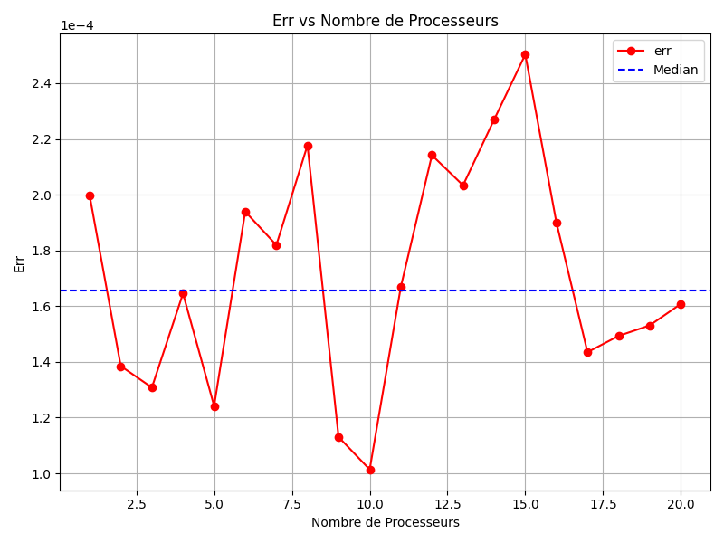

# Rapport Programmation Advancé

## Sommaire

#### [I/Introduction](#p1)
#### [II/TP1](#p2)
- [a) Objectif](#p2a)
- [b) Classe](#p2b)
- [c) Information](#p2c)
- [d) Representation](#p2d)
#### [III/TP2](#p3)
- [a) Objectif](#p3a)
- [b) Classe](#p3b)
- [c) Information](#p3c)
- [d) Representation](#p3d)
#### [IV/TP3](#p4)
- [a) Objectif](#p4a)
- [b) Classe](#p4b)
- [c) Information](#p4c)
#### [V/TP3 Version BlockingQueue](#p5)
- [a) Objectif](#p5a)
- [b) Classe](#p5b)
#### [VI/Monté Carlo et Parralélisation](#p6)
- [a) Monté Carlo](#p6a)
- [b) Parallélisation](#p6b)
- [c) Mise en oeuvre sur des Machines à Mémoire Partagé](#p6c)
  - [A) Assignement102](#p6cA)
  - [B) Pi.java](#p6cB)
- [d) Qualité et test de perf](#p6d)
- [e) Mise en Oeuvre en mémoire distribuer](#p6e)
- [f) Perf Master Worker distribuer](#p6f)


## <a name="p1"></a> 1/Introduction 

L’objectif de cette matière est d’approfondir notre connaissance sur 
l’environnement de développement pour cela, nous devions réaliser différents TP 
concernant les Threads , la synchronisation et la programmation concurrence.


Mais Avant de démarré ces Tp, nous devions Rechercher les différents 
caractéristique de l’ordinateur de travail, pour connaître les différents 
performances qu’avait chaque Pc. 

|                       | G25                                             | I21                                             | G24                                                      |
|-----------------------|-------------------------------------------------|-------------------------------------------------|----------------------------------------------------------|
| CPU                   | i7 4770,4c/8t, 304GHz,<br/>3.9GHz Turbo, 64-bit | i7 4770,4c/8t, 304GHz,<br/>3.9GHz Turbo, 64-bit | i7 4770,4c/8t, 304GHz,<br/>1.4GHz - 4.7GHz Turbo, 64-bit |
| RAM                   | 8Go RAM Micron MT16KTF1G64AZ-1 1G8E1 DD         |                                                 |                                                          |
| GPU                   |                                                 |                                                 |                                                          |
| Disque (C:)           |                                                 |                                                 |                                                          |
| Type de disque        | SSD                                             | SSD                                             | SSD                                                      |
| Fichier de pagination | Oui                                             | Oui                                             | Oui                                                      |
| Fichier d'échange     | Oui                                             | Oui                                             | Oui                                                      |

## <a name="p2"></a> 2/TP1

### <a name="p2a"></a> 2.1/Objectif

L’objectif de ce TP est d’afficher une Fenêtre où on peut retrouver un Mobile (sous la forme d’un carré) se déplacent de la gauche de la fenêtre jusqu'à la droite de la fenêtre.

Il fallait aussi permettre aux Mobile de faire un aller- retour (après avoir atteint la droite de la fenêtre il repartait vers la gauche).

Il fallait aussi ajouter un Bouton permettant d’arrêté le Mobile ou de lui permettre de continuer lors qu’on appuyait dessus.

### <a name="p2b"></a> 2.2/Classe


Comme on peut le voir dans ce graphique on utilise :
- 3 Classe
- 1 Inteface
- 2 Module

La classe **TPMobile()** n'a que une fonction main servant à lancé les autres classes

La classe **UneFenetre()** permet d'afficher une interface auquel seront afficher entre 1 et N Mobile

On y retrouve 2 attribut :
- LARG : il est de type Int et il signifie la Largueur de l'interface crée
- HAUT : il est de type Int et il signifie la Hauteur de l'interfece crée

On y retrouve 1 fonction :
- UneFenetre() : elle permet de crée un Interface et Initialiser les différents Mobiles

La classe **UnMobile()** permet d'initialiser un Mobile

On y retrouve 6 attribut :
- saLargeur : il est de type Int et il signifie la Largueur de l'interface (limite imposer)
- saHauteur : il est de type Int et il signifie la Hauteur de l'interface (limite imposer)
- sonDebDessin : il est de type Int et il signifie la Position du Mobile
- sonPas : il est de type Int et il signifie la distance de deplacement
- sonTemps : il est de type Int et il indique le temps d'attente entre ces déplacements (sa vitesse)
- sonCote : il est de type Int et il indique la taille du Mobile

On y retrouve 3 fonction :
- UnMobile() : fonction constructeur permettant d'initialiser les différents attibut de la classe
  - Il a besoin de 2 valeur telleLargeur et telleHauteur, ils sont tout les de type Int, l'un permet d'initialiser saLargeur et saHauteur
- run() : fonction servant à faire déplacer le Mobile sur l'interface
- paintComponent() : fontion permet de changer de couleur le Mobile


### <a name="p2c"></a> 2.3/Information

**Tread** : permet d'effectuer plusieurs action / programme en même temps.<br>
**Ressource critique** : Ressource utiliser que par 1 processus à la fois. Ex: Zone Mémoire, imprimante <br>
**Section critique** : Portion de code n'executant que 1 thread. (Mais plusisuer thread cherche à y asséder)<br>
**Verrou MUTEX** : verrou permettant de bloquer un thread durant une Exclusion Mutuelle<br>

### <a name="p2d"></a> 2.4/Representation
Voici une representation de la version Final du TP


## <a name="p3"></a> 3/TP2

### <a name="p3a"></a> 3.1/Objectif

L’objectif de ce TP est d’apprendre et tester ce qu’est la section critique.

Pour le réaliser nous devions demander à différente taches de d’afficher leur donné en même temps.

Par exemple Une première tache devait afficher AAA et une deuxième devait afficher BB, Il devait afficher de manière à avoir AAABB ou BBAAA  mais pas ABABA ni BAAAB et encore moins AABBA.

Nous devions après réaliser ce travail en utilisant des Sémaphores (pour notre cas nous n’utilisions qu’une version Binaire du Sémaphore)

### <a name="p3b"></a> 3.2/Classe

Dans ce TP on retrouve :
- 4 classes

La classe **Main()** n'a que une fonction main servant à lancé les autres classes

La classe **Affichage()** permet d'afficher un texte

On y retrouve 2 attribut :
- texte : il est de type String et il indique la texte qui seras afficher
- cemaphore : il est de type CemaphoreBinaire et il indique un CemaphoreBinaire

On y retrouve 2 fonction :
- Affichage() : fonction constructeur permettant d'initialiser les différents attibut de la classe
- run() : fonction servant à afficher l'attibut texte

La classe **CemaphoreBinaire()** utiliser comme Cemaphore mais seul 1 valeur peut avancer
<br> Il est une extention de Cemaphore
On y retrouve 2 fonction :
- CemaphoreBinaire() : fonction constructeur permettant d'initialiser les différents attibut de la classe
  - Il a besoin de 1 valeur valeurInitiale, il est de type int et il permet d'envoyer un numero indicant à Cempahore le nombre de personne pouvant sirculer 
- syncSignal() : fonction servant à envoyer un signal signifiant que l'acces est disponible

### <a name="p3c"></a> 3.3/Information

à la maniére d'un sémaphore on bloque l'accée pour que 1 thread passe à la fois<br>
**Wait()** = stop l'accée à la ressource<br>
**Signal()** = donne l'information que la ressource est libérrer<br>


### <a name="p3d"></a> 3.4/Representation

Comme on peut voir dans cet extrait de code 7 Tread sont lancé en même temps avec différentes valeur à afficher


Comme on peut le voir en Sortie Même si les 7 Traed sont lancé en même temps mais il affiche leur valeur les uns aprés les autres
(Dans cet exemple leur à été {B,D,G,E,F,A,C} )


## <a name="p4"></a> 4/TP3

### <a name="p4a"></a> 4.1/Objectif

L’objectif de ce TP était de simuler une boite aux lettre où des Producteur écrivait une lettre puis la déposait et un consommateur devait récupérer la lettre et la lire.

### <a name="p4b"></a> 4.2/Classe


Dans ce TP on retrouve :
- 4 classes

La classe **Main()** n'a que une fonction main servant à lancé les autres classes

La classe **Bal()** permet de stocker les Lettres et de savoir si une lettre est disponnible

On y retrouve 2 attribut :
- Boite : il est de type String et il contient le lettre (text enregistré)
- Avalaible : il est de type Boolean et il indique si une lettre est disponible ou non

On y retrouve 3 fonction :
- Bal() : fonction constructeur permettant d'initialiser les différents attibut de la classe
- Depot() : fonction Servant à enregistrée une nouvelle lettre
- Retirer() : fonction servant à obtenir le contenue de Boite quand Avalaible est False

La classe **Consomateur()** utiliser pour representer un Consomateur il a comme role de Retirer une lettre et de la lire

On y retrouve 2 attribut :
- Lettre : il est de type String et il contient le lettre (text enregistré)
- bal : il est de type Bal et il contient la Boite aux Lettre (Une classe Bal centrale)

On y retrouve 2 fonction :
- Consomateur() : fonction constructeur permettant d'initialiser les différents attibut de la classe
- run() : fonction servant à demander une lettre à la boite aux lettre (Element bal)
  
La classe **Producteur()** utiliser pour representer un Producteur il a comme role de Déposer une lettre dans la Boite aux Lettre (BAL)

On y retrouve 2 attribut :
- Lettre : il est de type String et il contient le lettre (text enregistré)
- bal : il est de type Bal et il contient la Boite aux Lettre (Une classe Bal centrale)

On y retrouve 2 fonction :
- Producteur() : fonction constructeur permettant d'initialiser les différents attibut de la classe
- run() : fonction servant à deposer une lettre dans boite aux lettre (Element bal)

### <a name="p4c"></a> 4.3/Information

Les differents modules cherche à avancer mais il sont bloquer par le Cemaphore ,
Il est possible que un module ne puisse pas avancer durant un long momment car le cemaphore ne lui lesse pas l'acces

### Les Moniteurs
Objet de syncronisation permettant l'exclusion mutuelle entre opérateur sur des données et d'attendre qu'une condition soit validé puis donner l'accées

Dans un moniteur on retrouve :
- Un attribut qui à la ressources partagé
- Un attribut qui à la variable de syncronisation
- Une méthode write
- Une méthode read

## <a name="p5"></a> 5/TP3 Version BlockingQueue

### <a name="p5a"></a> 5.1/Objectif

L’objectif de ce TP est de refaire le TP3 mais dans une Version BlockingQueue

### <a name="p5b"></a> 5.2/Classe


Dans ce TP on retrouve :
- 4 classes

La classe **Main()** n'a que une fonction main servant à lancé les autres classes

La classe **Boulangerie()** permet de stocker les Pain et de savoir si une PAIN est disponnible

On y retrouve 1 attribut :
- queue : il est de type String et il contient le lettre (text enregistré)

On y retrouve 3 fonction :
- depose() : fonction Servant à enregistrée un nouveau PAIN
- achete() : fonction servant à obtenir un Pain de la réserve (element queue)
- getStock() : fonction permettant de savoir le nombre de pain disponible

La classe **Mangeur()** utiliser pour representer un Consomateur il a comme role de Retirer un pain

On y retrouve 2 attribut :
- boulangerie : il est de type Boulangerie et il contient la Boulangerie (Une classe Boulangerie centrale)
- rand : il est de type Random et il contient le temps entre chaque demande

On y retrouve 2 fonction :
- Mangeur() : fonction constructeur permettant d'initialiser les différents attibut de la classe
- run() : fonction servant à demander un PAIN à la Boulangerie (Element boulangerie)

La classe **Boulanger()** utiliser pour representer un Producteur il a comme role de Déposer une lettre dans la Boite aux Lettre (BAL)

On y retrouve 1 attribut :
- boulangerie : il est de type Boulangerie et il contient la Boulangerie (Une classe Boulangerie centrale)

On y retrouve 2 fonction :
- Boulanger() : fonction constructeur permettant d'initialiser les différents attibut de la classe
- run() : fonction servant à deposer une PAIN dans Boulanger (Element boulangerie)


Dans cette version on ajoute aux pain une varaible Pain_Empoisonné pour ~~tuer~~ éléminer les Différents Mangeur


La classe Boulangerie ajoute une fonction deposePainEmpoisonne() pour commencer l'étermination

## <a name="p6"></a> 6/Monté Carlo et Parralélisation

Pour Réaliser Le Tp4, nous avons utiliser la Caluler Pi avec la Méthode de Monté Carlo
En le fesant avec une architecture à mémoire Partagé.

Pour cela nous avons utilisé la Méthode Master/Worker. Dans le quel le Master Récupére les Données et les Distribue à 
un nombre N de Worker pour que chaque Worker puisse calculer en Paralléle et en suite renvoier les valeur aux Master

Pour cela 2 code nous avait été fourni Assignment102 et Pi, tous les 2 crée dans le langage java.

### <a name="p6a"></a> I/Monté Carlo

Pour ce Tp nous avons utilisé Monté Carlo pour calculer π (Pi)

Pour cela nous commencions avec un carré de Coté 1, auquel on regarderas un de ces card de cercle

On y calculeras son aire (**_Ad_**) qui a un rayon (**_r_**) de 1 :

Ad = (π * r**2) / 4 = π / 4

On fait la même chose pour l'aire du Carré (**_Ac_**) avec un coté de rayon (**_r_**) de 1

Ac = r**2 = 1

On marqueras des Points (**_Xp(xp,yp)_**) dont les coordonnées sont tirées selon une loi uniforme( ]0,1[ )

Qui auront une Probabilité **_P_** que **_Xp_** soit tiré dans le quart de disque, Que nous avons calculer avec le calcule: 

**_P_** = Ad / Ac = π / 4

On effecturas un nombre de tirages aléatoires notés **_nt_**. Auquel on filtreras pour obtenir **_nc_** le nombre de points tirés dans le quard de disque.

On peut noté que plus **_nt_** est grand, plus on peut approximé **_P_** avec le calcule :

**_P_** = nc / nt  ~= π/4  D'où π ~= 4 * nc / nt


### Algorithme
```Code 
nc = 0;
nt = 100
for (p=0;p<nt;p++){
    xp = rand(); // loi U(]0,1[)
    yp = rand();
    if ((xp**2 + yp**2)<1 ){
        nc++;
    }
}
```

### <a name="p6b"></a> II/Parallélisation 

Pour Paralléliser une Méthode, il faut commencer par Identifier les Taches qui sont Réaliser.

En Prennant le calcule cité dans La partie 1.2, on y retrouve 2 Grosses Taches :
- T0: Tirer et compter **_nt_** points
- T1 : Caluler π

On peut aussi réalsier des Sous-Taches, Comme avec T0 que l'on peut décomposer en 2 sou-Tache :
- T0p1 : Tirer **_Xp_**
- T0p2 : incrémenter **_nc_**

On noteras aussi les Dépendence entre les Différente Taches :
- T1 dépend de T0
- T0p2 dépend de T0p1
- Les T0p1 sont indépendants selon p
- Les T0p2 sont indépendants selon p

On peut aussi Noté les Différentes Ressource Critique(Noté RC) :
- nc (le nombre de points tirés dans le quard de disque)

Dans le code on la retrouve dans : "**_nc++ ;_**"

### Version Master/Worker
```Code
function Master() {
    nW = NBWORKER               //Nombre de Worker
    nWpart = nt/nW              //Nombre de Valeur par Worker
    nc = [0,0,0,0]              //liste de point Réussi par Worker
    
    for(p=0;p<nW;p++){
        tread = Tread( Worker(nWpart,nc[p]) ) ;
        tread.start() ;
    }
    
    for(p=0;p<nW;p++){
        Cpt= Cpt + nc[p] ;
    }
    return Cpt;
}


function Worker(nt,nc){
    for (p=start;p<nt;p++){
    xp = rand();           
    yp = rand();
    if ((xp**2 + yp**2)<1 ){
        nc++;
    }
}
```

### <a name="p6c"></a> III/ Mise en oeuvre sur des Machines à Mémoire Partagé

### <a name="p6cA"></a> A/ Assignement 102

Modéle de Programmation parallèle : Tache

Paradigme : Maitre/ Worker

Il resemble beaucoup avec le code de la Partie 2.
On y retrouve la partie Worker (MonteCarlo) et
la partie Maitre(PiMonteCarlo pour inistialiser et getPi pour distribuer le travail)

Structure : 

```
Entrées : 
nt : nombre de points

Fonction TirerPoint()
    xp <- valeur aléatoire entre 0 et 1
    yp <- valeur aléatoire entre 0 et 1
    Retourne (xp^2 + yp^2 <1)
Fin Fonction

Procédure Principale
    nc <- 0
    Parrallel Pour i de 1 à nt
        Si TirerPoint() Alors
            Incrémenter nc
        Fin Si
    Fin Parrallel Pour
    
    π <- 4 * nc / nt
    Afficher "Estimation de π : " , π
Fin Procédure
    
```

### <a name="p6cB"></a> B/ Pi.java

Modéle de Programmation parallèle : Tache

Paradigme : Maitre/ Worker

Le fonctionnement différent comparer à Assignement102 car quand dans Assignement102 c'était une variable Atomique qui augmentait au fur et à mesure.
Dans Pi.java on execute les workers en paraléle et on récupére LEURS valeurs aprés leurs fin d'éxécution.
Que l'on va additionner pour obtenir le resultat.

Worker -> Compte les Valeurs et renvoie les  resultats <br>
Master-> Inistialise les Worker et les récupéres les valeurs <br>

Structure :

```
Entrées : 
nT : nombre de points
nW : nombre de Workers

Fonction TirerPoint()
    xp <- valeur aléatoire entre 0 et 1
    yp <- valeur aléatoire entre 0 et 1
    Retourne (xp^2 + yp^2 <1)
Fin Fonction

Fonction MonteCarloPartial(n_charge)
    nc_partial <- 0
    Pour i de 1 à n_charge Faire
        Si TirerPoint() Alors
            Incrémenter nc_partial
        Fin Si
    Fin Pour
    Retourner nc_partial
Fin Fonction

Procédure Principale
    nc <- nT / nW
    Liste nc <- Liste vide
    Pour chaque Worker de à nW
         nc_partial <- MonteCarloPartial(n_charge)
         Ajouter nc_partial à nc
    Fin Pour
    
    nc_Total <- Somme Valeur de nc
    π <- 4 * nc_Total / nt
    Afficher "Estimation de π : " , π
Fin Procédure
    
```

## <a name="p6d"></a> IV/Qualité et test de perf

Les Test ont été Réaliser sur 2 ordinateurs différents. Le Premier ce trouve à l'Iut de Velizy dans la Salle G26 dans la Zone de Devant auquel on peut trouver 4 Coeur.
Le Deuxiéme est Mon ordinateur Personnel, il comporte 6 Coeur.

| Salle     | Coeur |
|-----------|-------|
| G26-Avant | 4     |
| Perso     | 6     |

Différents Testes ont été réalisé, 2 on été réalisé dans la salle G26 (1 en Scalabilité Faible et 1 en Scalabilité Forte) 
et 12 on été réalisé sur mon Ordinateur auquel on retrouve 6 teste en Scalabilité Forte et 6 en Scalabilité Faible
Chacun comportant 3 teste par Fichier testé auquel on change le nombre de point pour voir les différentes variations entre les temps d'execution.

Chaque testé Réalisé les Calculs avec un nombre de Processeur allant de 1 à n (avec n le nombre de Processeur demander). 
Chaque Calcul est Réalisé nB fois (avec nB le nombre de Boucle). De maniére à obtenir une Moyenne de temps de réalisation 
pour chaque nombre de Processus de maniére à avoir une valeur plus stable.

| Experience    | Fichier Testé | Scalabilité | Nombre de Processeur | Nombre de Points | Nombre de Boucle(Moyenne) |
|---------------|---------------|-------------|----------------------|------------------|---------------------------|
| Ex1_G26-Avant | Pi            | Faible      | 20                   | 5000000          | 10                        |
| Ex2_G26-Avant | Pi            | Fort        | 20                   | 5000000          | 10                        |
| Ex1_Perso     | Pi            | Fort        | 20                   | 500000           | 10                        |
| Ex2_Perso     | Pi            | Fort        | 20                   | 5000000          | 10                        |
| Ex3_Perso     | Pi            | Fort        | 20                   | 10000000         | 10                        |
| Ex4_Perso     | Pi            | Faible      | 20                   | 500000           | 10                        |
| Ex5_Perso     | Pi            | Faible      | 20                   | 5000000          | 10                        |
| Ex6_Perso     | Pi            | Faible      | 20                   | 10000000         | 10                        |
| Ex7_Perso     | Assignment102 | Fort        | 12                   | 500000           | 1                         |
| Ex8_Perso     | Assignment102 | Fort        | 12                   | 5000000          | 1                         |
| Ex9_Perso     | Assignment102 | Fort        | 12                   | 10000000         | 1                         |
| Ex10_Perso    | Assignment102 | Faible      | 12                   | 500000           | 1                         |
| Ex11_Perso    | Assignment102 | Faible      | 12                   | 5000000          | 1                         |
| Ex12_Perso    | Assignment102 | Faible      | 12                   | 10000000         | 1                         |


Chaque Teste Comporte 2 Graphique le Premier Représente le Temps d'exécution en Fonction cu nombre de Processus 
et le Deuxiéme Représente le Temps d'exécution en Fonction du Temps de Calcul avec 1 Processeur.

Résultat de la Première Expérience Réalisée en Salle G26

Dans cette expérience, nous avons uniquement les résultats du temps d'exécution en fonction du temps de calcul avec 1 processeur.

Comme on peut le voir, la courbe est descendante car :
1. Un calcul avec une faible scalabilité signifie une augmentation du nombre de processus et du nombre de tâches à effectuer.
2. L'expérience a été réalisée sur un seul ordinateur, donc celui-ci doit répartir les différents processus sur ses cœurs.

On observe aussi une baisse importante du temps de réalisation entre les valeurs avec 8 processus et celles avec 9 processus, étant donné que l'on dépasse le nombre de cœurs disponibles en parallèle.

On peut donc conclure que le temps de calcul sera de plus en plus réduit en fonction du nombre de processus, car chaque processus doit effectuer le même nombre de tâches, peu importe leur nombre. Ainsi, le temps de calcul est soit stable, soit descendant. De plus, étant donné que l'expérience a été réalisée sur un ordinateur, le temps de calcul sera forcément plus lent avec un nombre élevé de processus, car cela demande de plus en plus d'espace, ce qui diminue les performances.


Résultat de la Deuxième Expérience Réalisée en Salle G26

Comme on peut le voir, la courbe est croissante car :
1. Un calcul avec une forte scalabilité signifie une augmentation du nombre de processus, mais avec un même nombre de points à calculer.

On observe aussi une baisse importante du temps de réalisation entre les valeurs avec 8 processus et celles avec 9 processus, étant donné que l'on dépasse le nombre de cœurs disponibles en parallèle.

On peut donc conclure que le temps de calcul sera de plus en plus rapide, car à chaque augmentation du nombre de processus, on permet de répartir équitablement le nombre de points entre eux.


Résultat de la Premiére Expérience Réalisé sur mon Ordinateur Personelle.

Comme on peut le voir, le temps d'exécution diminue de plus en plus, ce qui indique un gain de temps et une forte scalabilité.

Certains points semblent étranges dans ces graphiques, mais cela est dû au faible nombre de points.  
On note également que, dans le deuxième graphique, la courbe de **speedup** suit bien l'optimale (valeur recherchée) jusqu'à 9 processus avant de commencer à se stabiliser.


Résultat de la Deuxiéme Expérience Réalisé sur mon Ordinateur Personelle.

Comme dans l'expérience précédente, le temps d'exécution diminue de plus en plus, confirmant une forte scalabilité.

Contrairement aux résultats précédents, la courbe est beaucoup moins altérée et plus stable. On note seulement une légère augmentation des résultats avec 13 processus.  
On observe également que, dans le deuxième graphique, la courbe de **speedup** suit bien l'optimale jusqu'à 6 processus avant de s'en écarter pour se stabiliser aux environs de 10 processus.


Résultat de la Troisiéme Expérience Réalisé sur mon Ordinateur Personelle.

Comme dans l'expérience précédente, le temps d'exécution diminue, ce qui indique une forte scalabilité.

Les résultats sont similaires à ceux de l'expérience précédente. Une seule différence notable est observée dans le deuxième graphique : une diminution du **speedup** au niveau des 11 processus.


Résultat de la Quatriéme Expérience Réalisé sur mon Ordinateur Personelle.

Comme on peut le voir, le temps d'exécution augmente de plus en plus, ce qui signifie une perte de temps et indique une faible scalabilité.

Certains points semblent étranges dans ces graphiques, mais cela est dû au faible nombre de points.  
On note également que, dans le deuxième graphique, la courbe de **speedup** suit bien l'optimale jusqu'à 11 processus avant de commencer à diminuer.


Résultat de la Cinquiéme Expérience Réalisé sur mon Ordinateur Personelle.

Comme on peut le voir, le temps d'exécution est de plus en plus grand, ce qui signifie une perte de temps et indique une scalabilité faible.

Contrairement aux résultats précédents, la courbe est beaucoup moins altérée et beaucoup plus stable.

On peut aussi noter que dans le deuxième graphique, la courbe de **speedup** ne suit quasiment pas la courbe optimale : elle ne fait que diminuer.


Résultat de la Sixiéme Expérience Réalisé sur mon Ordinateur Personelle.

Comme on peut le voir, le temps d'exécution est de plus en plus grand, ce qui signifie une perte de temps et indique une scalabilité faible.

Les résultats sont similaires à ceux de l'expérience précédente.


Résultat de la Septiéme Expérience Réalisé sur mon Ordinateur Personelle.

Comme on peut le voir, le temps d'exécution est de plus en plus petit, ce qui signifie un gain de temps et indique une scalabilité forte.

Certains points semblent étranges dans ces graphiques, mais cela est seulement dû au faible nombre de points.

Contrairement aux résultats avec la fonction **Pi**, **Assignment102** semble donner des résultats beaucoup plus élevés et plus variés.  
On observe aussi que, dans le deuxième graphique, le calcul du **speedup** est très bas : il ne dépasse jamais un gain de vitesse de 3, quel que soit le nombre de processus.


Résultat de la Huitiéme Expérience Réalisé sur mon Ordinateur Personelle.

Comme dans la précédente expérience, les résultats sont variés et instables. Le **speedup** augmente très peu, voire diminue.


Résultat de la Neuviéme Expérience Réalisé sur mon Ordinateur Personelle.

Comme dans la précédente expérience, les résultats sont variés et instables. Le **speedup** augmente très peu, voire diminue.


Résultat de la Dixiéme Expérience Réalisé sur mon Ordinateur Personelle.

Comme on peut le voir, le temps d'exécution est de plus en plus grand, ce qui signifie une perte de temps et indique une scalabilité faible.

Le temps de calcul est très élevé, contrairement aux résultats obtenus avec la fonction **Pi**. De plus, le calcul du **speedup** ne fait que diminuer de plus en plus rapidement.


Résultat de la Onziéme Expérience Réalisé sur mon Ordinateur Personelle.

Comme on peut le voir, le temps d'exécution est de plus en plus grand, ce qui signifie une perte de temps et indique une scalabilité faible.

Les résultats sont les mêmes que ceux de l'expérience précédente.


Résultat de la Douziéme Expérience Réalisé sur mon Ordinateur Personelle.

Comme on peut le voir, le temps d'exécution est de plus en plus grand, ce qui signifie une perte de temps et indique une scalabilité faible.

Les résultats sont similaires à ceux de l'expérience précédente.


### Performance Efficiency

Maintenant que nous avons comparer les différents résultats des 2 fonctions, nous pouvons maintenant nous consentrer sur leur efficacité

Pour ce faite nous allons comparer leur marge d'erreur dans leur resultat de Pi par rapport au résultat Réel de Pi

Commmencons par la **_Scalabilité Faible_**, dans le premier graphique nous pouvons voir les Résultats de **Assignement102** et dans le deuxiéme ceux de **Pi**.

 


Comme on peut le voir la courbe de **Pi** est plus stable et à beaucoup moins de variété Comparer à celle de **Assignement102** qui est instable et varié dans ces résultats.

On peut aussi noté que le premier point de Pi commence à une erreur de 2.8E-4 alors que Assignement102 commence à 3.2E-4, dans le même cas la median de la courbe de Pi est à 6E-5 alors que Assignement102 est à 8E-5.

On peut donc en conclure que pour la Scalabilité Faible, il est préférable d'utiliser Pi avec le quel on obtient des résultats plus stable et précis plutot Assignement102 qui lui à des résultat trés variables et imprécis.

Parlons Maintenant de la Scalabilité Fort, dans le premier graphique nous pouvons voir les Résultats de **Assignement102** et dans le deuxiéme ceux de **Pi**.

 


Comme on peut le voir dans le graphique 1, la courbe de Assignement102 est plus stable mais à certaine valeur élever dans ces résultats, dans le graphique 2, la courbe de Pi est plus instable dans ces résultats mais à une dispertion moins élever.

On peut aussi noté que dans les deux graphiques la médian est à environ 1.7E-4, à la différence que dans Pi les Résultats reste entre 2.5E-4 et 1E-4 alors que dans Assignment102 les résultats sont entre 6.4E-4 et 0.1E-4. On a donc des résultats plus varié dans Assignment102 que dans Pi mais ce sont des résultats plus éloigné et qui on la même median que ceux obtenu grace à Pi.

On peut donc en Conclure que pour la Scalabilité Fort, il est préférable d'utiliser Pi avec le quel on obtient des résultats plus instable mais moins dispercé plutot que Addignment102 qui à des Résultats plus stable mais plus éloigner.

### Conclusion

Les résultats obtenus en utilisant la fonction **Pi** sont plus proches de l'optimale que ceux obtenus avec la fonction **Assignment102**.

De plus, les résultats avec la fonction **Pi** sont significativement plus petits que ceux issus de **Assignment102** (environ 10 fois plus rapides).

Ainsi, on peut conclure que la fonction **Pi** est nettement plus performante pour les calculs, contrairement à la fonction **Assignment102**.

Il est donc plus pertinent et intéressant de continuer avec la fonction **Pi** plutôt qu'avec **Assignment102**.

## <a name="p6e"></a> V/Mise en Oeuvre en mémoire distribuer

### 1. Exécution du Code Distribué
### Configuration des composants :

- WorkerSocket :

  - Attribut requis : port.

  - Chaque instance d'un WorkerSocket écoute sur un port unique spécifié lors de son initialisation.

- MasterSocket :

  - Précondition : Avant de lancer le MasterSocket, les instances de WorkerSocket doivent être initialisées et prêtes à recevoir des connexions.

  - Fonction : Le MasterSocket est conçu pour coordonner les Workers et répartir les tâches de manière efficace.

### Schéma d’exécution :

1. Initialiser les Workers :

   - Créer plusieurs instances de WorkerSocket sur des ports distincts.

2. Lancer le MasterSocket :

   - Se connecte aux Workers disponibles.

   - Distribue les tâches de calcul.

Le processus suit le modèle suivant :
```
(Ms) -> ((Ws))
          M -> (W)
            -> (W) 
     -> ((Ws))
          M -> (W)
            -> (W)
```

### 2. Modification : Calcul de π avec Monte Carlo

### Intégration dans le WorkerSocket

Pour calculer π (π = 3.14159...), le WorkerSocket doit être modifié pour inclure une logique de Monte Carlo.

Deux options sont disponibles pour intégrer cette fonctionnalité :

**Option 1 : Ajouter une Fonction Dédiée**

- Utiliser une fonction Monte Carlo dans le code du WorkerSocket.

- Exemple :
```
public double Monte_Carlo(int iterations) {
    int insideCircle = 0;
    for (int i = 0; i < iterations; i++) {
    double x = Math.random();
    double y = Math.random();
    if (x * x + y * y <= 1) {
    insideCircle++;
    }
    }
    return 4.0 * insideCircle / iterations;
}
```

Option 2 : Intégrer la Logique Directement dans main

- Modifier la méthode main existante :

```
public void main() {
    int iterations = 1000000; // Exemple : 1 million d’itérations
    double pi = Monte_Carlo(iterations);
    System.out.println("Calculated π: " + pi);
}
```

### Nouvelle version d’exécution avec Pi.java

Le système peut inclure un appel au composant Pi.java pour effectuer le calcul, à partir du MasterSocket :

```
(Ms) -> ((Ws))
         call Pi.java with Aw
     -> ((Ws))
```

### 3. Interopérabilité du WorkerSocket

Le WorkerSocket peut interagir avec des bibliothèques externes ou d’autres composants, selon la configuration :

- Appeler un Autre Code Monte Carlo :

  - Oui, en encapsulant l’implémentation de Monte Carlo dans une classe séparée (par exemple, MonteCarloPi.java) et en y faisant référence depuis le WorkerSocket.

- Interopérer avec d’Autres Composants :

  - Le WorkerSocket peut recevoir des commandes du MasterSocket pour étendre ses capacités.

  - Les données peuvent être transmises par sockets ou par des API REST si le projet est adapté.


## <a name="p6f"></a> VI/ Perf Master Worker distribuer

### Calcule de Performance de MasterSocker et WorkerSocket

   | Number Worker M1/M2 | 1 /1     | 2/1      | 3 /1     | 1/10     | 2/ 10    | 3/10     | 1/100    | 2/100    | 3/100    | 1/1000   |
   |---------------------|----------|----------|----------|----------|----------|----------|----------|----------|----------|----------|
   | Temps d'execution   | 504ms    | 530ms    | 564ms    | 815ms    | 1070ms   | 1700ms   | 5100ms   | 11100ms  | 14900ms  | 50000ms  |
   | totalCount          | 16000000 | 16000000 | 16000000 | 16000000 | 16000000 | 16000000 | 16000000 | 16000000 | 16000000 | 16000000 |


| Machines | Points totaux | Points / Worker | Nb Processeurs | Temps |
|----------|---------------|-----------------|----------------|-------|
| 1        | 192000000     | 192000000       | 1              | 5873  |
| 1        | 192000000     | 96000000        | 2              | Nc    |
| 1        | 192000000     | 64000000        | 3              | Nc    |
| 1        | 192000000     | 48000000        | 4              | 1506  |
| 2        | 192000000     | 24000000        | 8              | 756   |
| 3        | 192000000     | 16000000        | 12             | 508   |
| 4        | 192000000     | 12000000        | 16             | 385   |
| 6        | 192000000     | 8000000         | 24             | 267   |
| 8        | 192000000     | 9000000         | 32             | 206   |
| 12       | 192000000     | 4000000         | 48             | 133   |


### Calcul de Scalabilité forte de MasterSocker et WorkerSocket avec plusieurs Ordinateurs

Comme on peut le voir la courbe de Speedup en fonction du nombre de processeur est trés proche de celle optimale (valeur rechercher)

Elle est beaucoup plus performant dans ces Calculs que la Fonction Pi réaliser sur un seul ordinateur

| Machines | Points totaux | Points / Worker | Nb Processeurs | Temps |
|----------|---------------|-----------------|----------------|-------|
| 1        | 4000000       | 4000000         | 1              | 129   |
| 1        | 8000000       | 4000000         | 2              | Nc    |
| 1        | 12000000      | 4000000         | 3              | Nc    |
| 1        | 16000000      | 4000000         | 4              | 140   |
| 2        | 32000000      | 4000000         | 8              | 143   |
| 3        | 48000000      | 4000000         | 12             | 136   |
| 4        | 64000000      | 4000000         | 16             | 134   |
| 6        | 96000000      | 4000000         | 24             | 139   |
| 8        | 128000000     | 4000000         | 32             | 140   |
| 12       | 192000000     | 4000000         | 48             | 141   |


Comme on peut le voir la courbe de Speedup en fonction du nombre de processeur est trés proche de celle optimale (valeur rechercher)

Elle est beaucoup plus performant dans ces Calculs que la Fonction Pi réaliser sur un seul ordinateur

### Calcul de Scalabilité forte de MasterSocker et WorkerSocket avec plusieurs Ordinateurs

Comme on peut le voir sur les Résultats du Temps d'éxécution, Les résultats sont beaucoup plus proche de l'objectif 
d'optimisation que les Résultats obtenir pour Pi avec Un seul ordinateur. On peut donc Conclure que Calcul distribué est Beaucoup plus performant que le Calcul avec un Ordinateur.

| Machines Total | Machines Master | Machines Worker | Points totaux | Points / Master | Points / Worker | Nb Processeurs | Temps |
|----------------|-----------------|-----------------|---------------|-----------------|-----------------|----------------|-------|
| 16             | 4               | 16              | 192000000     | 48000000        | 12000000        | 16             | 106   |
| 32             | 8               | 32              | 192000000     | 24000000        | 6000000         | 32             | 60    |
| 48             | 12              | 48              | 192000000     | 16000000        | 4000000         | 48             | 44    |

### Calcul de Scalabilité faible de MasterSocker et WorkerSocket avec plusieurs Ordinateurs

Ancun Résultat n'est entré dans ces Expériences car aussi test n'a été effectuer

| Machines Total | Machines Master | Machines Worker | Points totaux | Points / Master | Points / Worker | Nb Processeurs | Temps |
|----------------|-----------------|-----------------|---------------|-----------------|-----------------|----------------|-------|
| 16             | 4               | 16              | 64000000      | 16000000        | 4000000         | 16             | Nc    |
| 32             | 8               | 32              | 128000000     | 16000000        | 4000000         | 32             | Nc    |
| 48             | 12              | 48              | 192000000     | 16000000        | 4000000         | 48             | Nc    |

